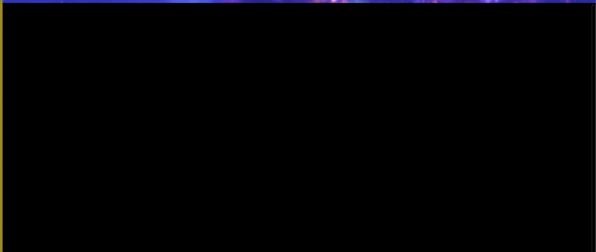

# BOOM

#My version of Patatap - animation and sound kit. With pressing letter keys on the keyboard create melodies and shapes, save and replay them. 

## Installation 

Fork and clone the repository

CD into  boom_frontend

Run index.html 

## Libraries 
#To create sounds Howler.js
#To create animations Paper.js 

## Contributing
#Pull requests are welcome.

## Demonstration 

